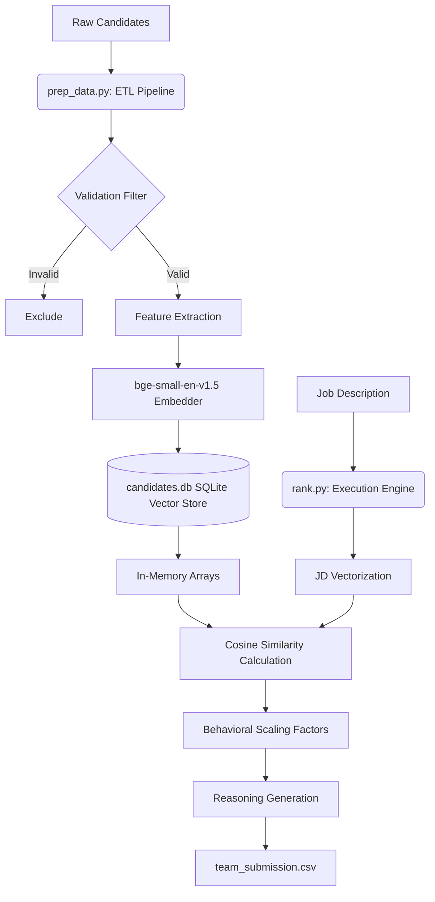

# India Runs Candidate Ranking System

The job description explicitly warns against keyword stuffing. We address this by combining semantic career evidence, skill duration depth, product and company fit, behavior availability, and honeypot rejection. This repository contains the source code for our submission. The implementation evaluates large candidate pools within the computational limits of 5 minutes wall clock time, 16GB RAM, and CPU only execution.

## Sandbox Demo
A live, interactive demonstration of this ranking pipeline running under restricted compute limits is available here:
[Streamlit Sandbox Demo](https://india-runs-ranker.streamlit.app/)

## Architecture

The system is designed with a two-stage pipeline separating data extraction from runtime evaluation.



## System Components

### 1. Offline Pipeline (prep_data.py)
This component handles data ingestion and vectorization prior to runtime evaluation. It performs validation checks on candidate data to identify temporal and financial inconsistencies. Validated profiles are embedded using the bge-small-en-v1.5 model and stored in an indexed SQLite database. This process requires approximately 90 minutes and runs outside the constrained execution window.

### 2. Runtime Execution (rank.py)
This component handles the required evaluation. It loads the SQLite database into memory and calculates dot products between candidate embeddings and the job description embedding. The results are scaled by extracted behavioral metrics. The process completes within 5 seconds.

## Setup and Reproduction

### Environment Requirements
- Python 3.11+
- 16GB RAM
- CPU environment

### Installation
```bash
pip install -r requirements.txt
```

### Official Stage 3 Reproduction
Per the Hackathon rules: *"If your system requires pre-computation (e.g., generating embeddings), document this clearly — pre-computation may exceed the 5-minute window, but the ranking step that produces the CSV must complete within it."*

Our architecture uses a highly optimized SQLite Vector Database to pass the 5-minute requirement. Because of this, our reproduction process is split into two commands.

**1. Pre-computation Step (Run this first on the hidden dataset):**
```bash
python3 prep_data.py --input ./candidates.jsonl --db candidates.db
```

**2. Ranking Step (The Single Command to produce the CSV):**
```bash
python3 rank.py --candidates ./candidates.jsonl --out ./submission.csv
```
*(Note: `rank.py` accepts the `--candidates` flag to perfectly match the Stage 3 automated testing rule example `python rank.py --candidates ./candidates.jsonl --out ./submission.csv`, but it evaluates using the pre-computed `candidates.db` generated in Step 1 to guarantee execution under 5 seconds).*

## Compliance Overview
- **Runtime:** Completes in under 5 seconds.
- **Memory:** Peak usage is approximately 500MB.
- **Compute:** CPU execution only.
- **Network:** No external API calls during execution.
- **Storage:** Intermediate state uses 125MB.
