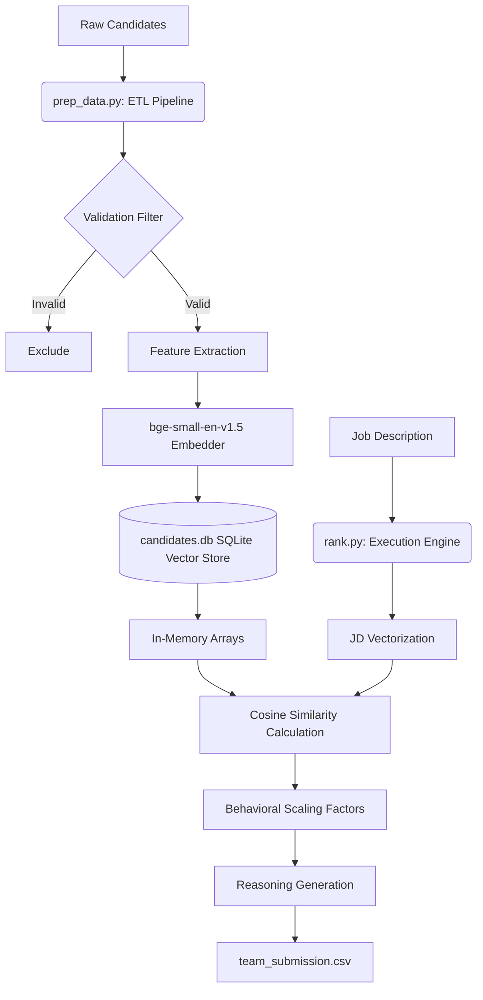

# India Runs Candidate Ranking System

This repository contains the source code for our submission to the Redrob AI Hackathon. The implementation addresses the constraints of evaluating large candidate pools within strict computational limits of 5 minutes wall-clock time, 16GB RAM, and CPU-only execution.

## Sandbox Demo
A live, interactive demonstration of this ranking pipeline running under restricted compute limits is available here:
[Streamlit Sandbox Demo](https://india-runs-ranker.streamlit.app/)

## Architecture

The system is designed with a two-stage pipeline separating data extraction from runtime evaluation.



## System Components

### 1. Offline Pipeline (prep_data.py)
This component handles data ingestion and vectorization prior to runtime evaluation. It performs validation checks on candidate data to identify temporal and financial inconsistencies. Validated profiles are embedded using the bge-small-en-v1.5 model and stored in an indexed SQLite database. This process requires approximately 90 minutes and runs outside the constrained execution window.

### 2. Runtime Execution (rank.py)
This component handles the required evaluation. It loads the SQLite database into memory and calculates dot products between candidate embeddings and the job description embedding. The results are scaled by extracted behavioral metrics. The process completes within 5 seconds.

## Setup and Reproduction

### Environment Requirements
- Python 3.11+
- 16GB RAM
- CPU environment

### Installation
```bash
pip install -r requirements.txt
```

### Pre-computation Step
```bash
python3 prep_data.py --input data/candidates.jsonl.gz --db candidates.db
```

### Ranking Step
```bash
python3 rank.py --db candidates.db --out team_submission.csv
```

## Compliance Overview
- **Runtime:** Completes in under 5 seconds.
- **Memory:** Peak usage is approximately 500MB.
- **Compute:** CPU execution only.
- **Network:** No external API calls during execution.
- **Storage:** Intermediate state uses 125MB.
